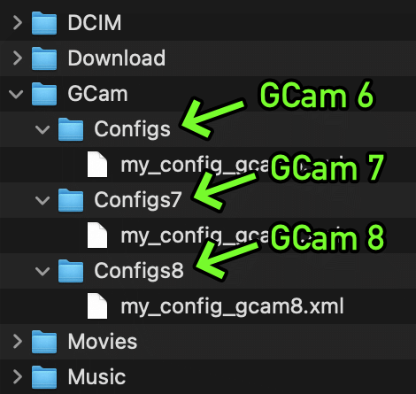
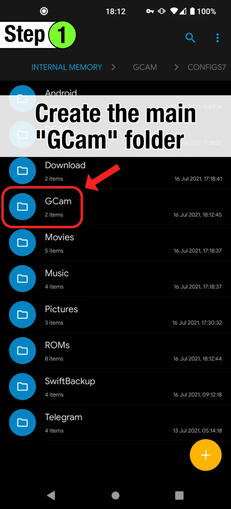

# Recenzja softu
*crDroidAndroid-14.0-20240819-ginkgo-v10.7* \
*Xiaomi Redmi Note 8T* \
Matiz - udało się zainstalować. Nie działają tapety, bo nikki gapps mi nadpisało luncher i tapety? Jeszcze robienie screenshota gestem 3 palców nie działa - to też może być wina, że w wersji GApps Stock domyślny luncher apek jest zamieniony na Pixel Luncher. A tak ogólnie to a początku byłem zachwycony. Potem wszystko wróciło do normy, to znaczy telefon tnie się jak cholera. No ale i tak ma już 5 lat. Odinstalowałem część apek, wymusiłem zakończenie pracy i przestawiłem na "disable" w ustawienia/apps i jest trochę lepiej - podobno trzeba tak zamykać apki, to telefon lepiej chodzi. Ogólnie szału nie ma. Następnym razem spróbowałbym wersję Nikki Gapps najmniejszą (core) zamiast "Stock" (wtedy nie podmieni mi lunchera na Pixel Luncher).

# Pliki
**w tym folderze, folderze bazowym, są plkiki do Android 14**
**pliki do Androida 15 - w folderze A15**
1. *info_mm.md* - ten plik
2. *'Install Official crDroid.mp4'* - lepszy tutorial, ale bez unlock
3. *'How to Root Magisk using TWRP.mp4'* - gorszy tutorial
4. *crDroidAndroid-14.0-20240819-ginkgo-v10.7.zip* - plik z systemem crdroid (dla Redmi Note 8T), nie trzeba rozpakowywać
5. *NikGapps-full-arm64-14-20241231-signed.zip* - aplikacje googla w wersji rozszerzonej - pełen pakiet
6. *NikGapps-core-arm64-14-20250127-signed.zip* - tylko niezbędne pliki do działaniu Google Play
7. *nikgapps.config* - plik konfiguracyjny do instalowania Gapps, można sobie wybrać, które chce się zainstalować
8. *RO2RW-StableBeta.v3.7.2.1.zip* - to miało być niezbędne do zainstalowania sklepu Google, ale jednak okazało się niepotrzebne
9. *'OrangeFox-ginkgo-stable@R11.1.zip'* - TWRP, tylko lepsze, potrzebne żeby sflashować system na telefon
10. *'OrangeFox-ginkgo-stable@R11.1'/*
11. *platform-tools-latest-windows.zip* - rozpakować i dodać do ścieżki (path), są to narzędzia do obsługi telefonu po kablu, najważniejsze to adb \
(update) właściwie to nawet nie trzeba dodawać do ścieżki. Można operować z poziomu folderu, w którym są te narzędzia.
12. *platform-tools-latest-windows/*
13. *Qualcomm_USB_Driver_v1.0.10065.1.zip* - sterownik Qualcomm (wybiera się w zależności od procesora telefonu, żeby komunikować się komendami w terminalu po kablu z telefonem). Rozpakować i zainstalować.
14. *Qualcomm_USB_Driver_v1.0.10065.1/*
15. *miflash_unlock-en-6.5.224.28.zip* - oryginalny program ze strony xiaomi do odblokowywania telefonu
16. *miflash_unlock-en-6.5.224.28/*
17. *XMT2_Win_Setup_20.7.28.zip* - open source program do obsługi xiaomi, jeśli jest problem z widocznością telefonu w trybie fastboot, to ten program pobierze potrzebne sterowniki i umożliwi połączenie
18. *XMT2_Win_Setup_20.7.28.exe*
19. *GCam_7.3.018_Urnyx05-v2.5.apk* - podobno najlepsza apka GCam dla Redmi Note 8T
20. *GCam_configs/* - pliki konfiguracyjne do GCam
21. *GCAM-load-config.webp* - wideo instrukcja instalacji plików config do GCam
22. *GCam-folders.webp* - struktura folderów do configów GCam

# CrDroid strona
https://crdroid.net/downloads#google_vignette \
https://crdroid.net/ginkgo/10 \
Forum XDA

# Aplikacje Google
https://nikgapps.com/ \
(na stronie crDroid też jest link od razu przy obrazie systemu)

# Tutoriale
*Xiaomi Note 8 (Ginkgo) & Note 8T (Willow) : Tutorial Howto Root Magisk using TWRP* \
**'How to Root Magisk using TWRP.mp4'** \
[hindus - ten sam model](https://www.youtube.com/watch?v=N_TbR2elBCE&t=101s) \
*Install Official Android 14 crDroid ON Redmi Note 12 4G English* \
**'Install Official crDroid.mp4'** \
[inny model - z tego korzystałem i akcja zakończyła się sukcesem](https://www.youtube.com/watch?v=2t71pAggh1U&t=259s)

## Unlock telefonu
(to jako efekt uboczny usunie wszystkie dane z telefonu)
1. Włączyć debuggowanie USB i OEM unlocking
2. podłączyć telefon, otworzyć terminal i wpisać adb reboot bootloader
3. włączyć miflash_unlock
zalogować się \
kliknąć Unlock \
czasem trzeba czekać ileś godzin, np ja musiałem czekać 168 h \
jeśli program xiaomi nie działa, to próbujemy z XMT2_Win_Setup_20.7.28.exe

## Flashowanie OrangeFox i nowego systemu
1. W telefonie: Włączyć debuggowanie USB i OEM unlocking
2. Odblokować bootloader (patrz "Unlock telefonu")
3. Naładować baterię do pełna
4. Zaktualizować telefon do najwyższej fabrycznej wersji
5. Wyłączyć telefon \
Na kompie:
6. rozpakować *platform-tools-latest-windows.zip*
7. rozpakować *'OrangeFox-ginkgo-stable@R11.1.zip'*
8. Otworzyć rozpakowany folder *'OrangeFox-ginkgo-stable@R11.1'/* i skopiować *recovery.img*
9. Otworzyć rozpakowany folder *platform-tools-latest-windows/* i wkleić tam skopiowane w poprzednim kroku *recovery.img*
10. Lewym przyciskiem myszy kliknąć na *cmd.exe* i wybrać "Run as administrator" \
telefon:
11. Przycisnąć i przytrzymać "volume down"
12. [trzymając wciśnięty guzik "volume down"] Podłączyć telefon do komputera kablem
13. Jak pojawi się logo fastboot, to puszczamy przycisk \
na kompie:
14. W otworzonym cmd wpisujemy: \
fastboot flash recovery recovery.img
15. Teraz musimy zbootować telefon do recovery. W tym celu wpisujemy: \
fastboot reboot \
zatwierdzamy enter i w od razu przytrzymujemy "volume up" na telefonie \
Jak pojawi się logo OrangeFox, to puszczamy przycisk
16. na kompie: otwieramy folder telefonu i sprawdzamy, czy widać nazwy folderów - czy nie są zaszyfrowane
17. Kopiujemy *crDroidAndroid-14.0-20240819-ginkgo-v10.7.zip* i wrzucamy do głównego folderu na telefonie
18. na telefonie: 3 menu od lewej (Wipe) \
jak jest do wyboru Wipe i Format Data, to wchodzimy w Wipe \
zaznaczamy: \
([x] - zaznaczone, [ ] - niezaznaczone) \
[x] Dalvik / ART Cache \
[x] Cache \
[ ] Micro SDCard \
[ ] USB-Storage \
[x] Metadata \
[x] Data \
[ ] Internal Storage \
Swipe to Wipe \
Back
19. dalej na telefonie: \
wchodzimy w pierwsze menu (Files) \
klikamy plik z naszym ROMem (*crDroidAndroid-14.0-20240819-ginkgo-v10.7.zip*) \
bez zmian, ale wygląda to tak: \
[ ] Reboot after installation is complete \
[ ] ZIP signature verification \
[ ] Reflash OrangeFox after flashing a ROM \
[ ] Unmount System before installing a ZIP \
[x] Unmount Vendor before installing a ZIP \
Swipe to Install \
Back
20. na kompie: \
kopiujemy plik *'OrangeFox-ginkgo-stable@R11.1.zip'* \
wklejamy w głównym folderze telefonu \
klikamy drugie drugie menu i z powrotem klikamy pierwsze menu (Files) \
klikamy plik *'OrangeFox-ginkgo-stable@R11.1.zip'* \
bez zmian, ale wygląda to tak: \
[ ] Reboot after installation is complete \
[ ] ZIP signature verification \
[ ] Reflash OrangeFox after flashing a ROM \
[ ] Unmount System before installing a ZIP \
[x] Unmount Vendor before installing a ZIP \
Swipe to Install \
(robimy to, bo crDroid nadpisał Recovery swoim własnym recovery i chcemy z powrotem zflashoować OrangeFox jako nasze Recovery)
21. Na telefonie: \
po instalacji powinniśmy znajdować się w pierwszej zakładce (Files) \
Widzimy tylko folder "Fox" \
klikamy strzałkę idź poziom wyżej \
klikamy folder "Data" \
klikamy folder "media" \
tam powinno nic nie być - to znaczy, że mamy zaszyfrowany dysk \
musimy go odszyfrować. \
Wchodzimy w trzecie menu (Wipe) \
zakładka Format Data \
wpisujemy "yes" \
Back \
Wchodzimy w ostatnie, czwarte, menu (Menu) \
klikamy Reboot \
klikamy Recovery \
teraz w kompie nasz telefon powinien być niewidoczny - nie da się otworzyć folderu
22. Na telefonie: \
po instalacji powinniśmy znajdować się w pierwszej zakładce (Files) \
Widzimy tylko folder "Fox" \
klikamy folder "Data" \
powinno nie być tam widocznego folderu "media", jest tylko "recovery" \
klikamy w trzy kropki po prawej na telefonie u góry \
klikamy Create Folder \
wpisujemy "media" \
Wchodzimy w ostatnie, czwarte, menu (Menu) \
klikamy Mount \
odklikujemy Enable MTP (ma być wyłączone): \
Enable MTP [ ] \
klikamy Enable MTP (ma być włączone): \
Enable MTP [x] \
teraz w kompie nasz telefon powinien być z powrotem widoczny
23. Tego kroku nie musiałem robić \
Nawet nie dało się tego zainstalować \
Ale w instrukcji jest: \
na kompie: \
skopiować *RO2RW-StableBeta.v3.7.2.1.zip* na telefon \
na telefonie: \
otwieramy media \
klikamy *RO2RW-StableBeta.v3.7.2.1.zip* \
bez zmian, ale wygląda to tak: \
[ ] Reboot after installation is complete \
[ ] ZIP signature verification \
[ ] Reflash OrangeFox after flashing a ROM \
[ ] Unmount System before installing a ZIP \
[x] Unmount Vendor before installing a ZIP \
Swipe to Install \
Back \
Wchodzimy w ostatnie, czwarte, menu (Menu) \
klikamy Reboot \
klikamy Recovery
24. na kompie: \
Kopiujemy wybrane NikGapps.zip na telefon \
możemy odłączyć telefon od kompa
25. Klikamy drugie menu i z powrotem pierwsze (Files) \
Klikamy NikGapps.zip \
bez zmian, ale wygląda to tak: \
[ ] Reboot after installation is complete \
[ ] ZIP signature verification \
[ ] Reflash OrangeFox after flashing a ROM \
[ ] Unmount System before installing a ZIP \
[x] Unmount Vendor before installing a ZIP
26. na telefonie: \
Back \
Trzecie menu (Wipe) \
zakładka Format Data \
wpisujemy "yes" \
Reboot System
27. GOTOWE!

# Aparat GCam
Pixel Camera od Googla \
[ciekawy wątek na XDA](https://xdaforums.com/t/best-gcam-mod-for-redmi-note-8.3970675/) \
[podobno najlepszy GCam i config na Redmi Note 8T](https://www.celsoazevedo.com/files/android/google-camera/f/changelog1500/) \
*jakiś typ przetestował z 20 i mówi, że ten jest najlepszy* \
Apkę instaluje się standardowo. \
Nieco więcej zachodu jest z configami.

>How to Load & Save XML Configs
>
>Some GCam versions support import/export of .xml files, allowing users to quickly load the best settings for their phone.
>
>Config files are stored inside a folder, which needs to be created manually using a file manager or automatically by saving your config:
>
> - GCam 8.x: /GCam/Configs8/
> - GCam 7.x: /GCam/Configs7/
> - GCam 6.x: /GCam/Configs/
>
>⚠️ To load a config, move the .xml file into this folder. Check instructions below.
>
>⚠️ Some versions use a different directory. This is usually mentioned on the configs/changelog page (example).
>
>The top folder, /GCam/, must be created on the same level as the DCIM, Downloads, etc, folders. Example:
>
>
>
>How to load / import .xml files »
>
>It's very easy:
>
>1. Create the folder for the GCam version you're using.
>2. Move the .xml file into this folder.
>3. ⚠️ Android 11 and above: You may have to allow GCam to "allow management of all files" inside the app permissions → files and media.
>4. Open GCam.
>5. Double click the dark area around the shutter button.
>6. Select the config (.xml file) and "restore" (sometimes you have to do it twice).
>
>Video guide:
>
>

pliki konfiguracyjne - twórca uważa, że są ułożone w kolejności od najlepszego do najgorszego:
- *RemiNote8_bestxmlV1.0.xml*
- *MTX-trCam-V5-Natural-1.xml*
- *xiaomi-redmi-note-8-by-makkoro.xml*
- *pyur_urnyx05_7.3v1.8night.xml*

# Kernel
Po instalacji ROMu, flashujemy Recovery Orange Fox
A POTEM NA KONIEC możemy wgrać kompatybilny custom Kernel
Ja wgrałem Cryo Kernel i całkiem nieźle śmiga